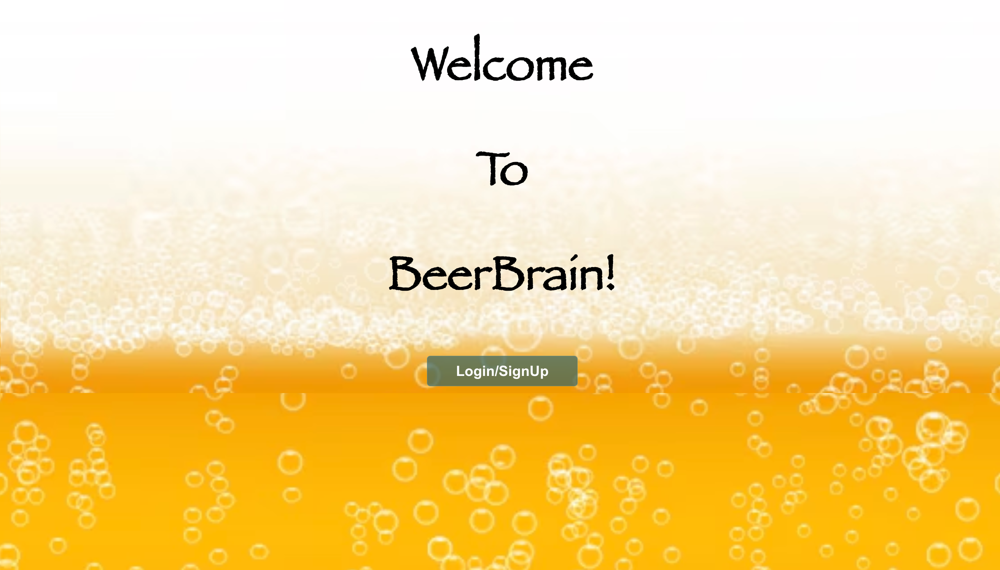
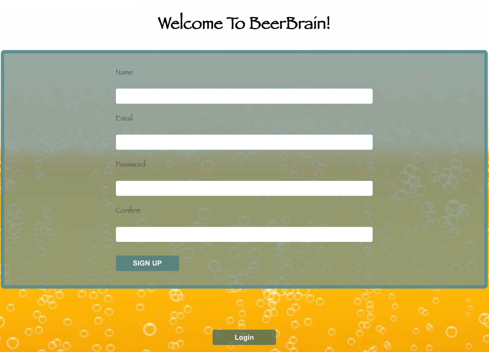
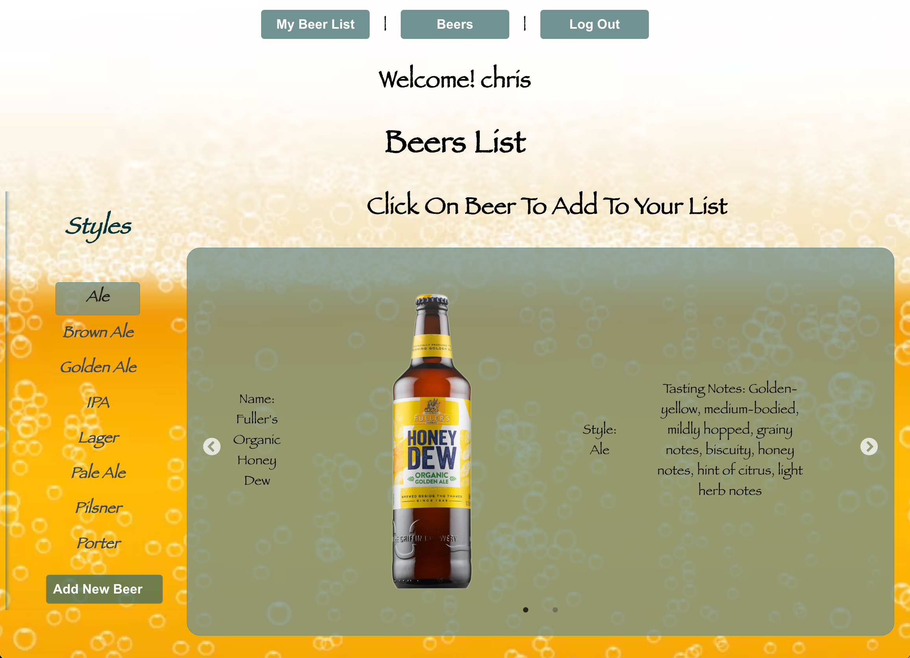

  

  # BeerBrain

  ### [CLICK TO DEMO](https://beerbrain-99ea62159aa4.herokuapp.com/)

  ##### Chris Sakae

  ## :pencil: Description

  BeerBrain is a place for people who want to learn and test their basic knowledge about beer. At BeerBrain we encourage you to add beers that you've tried with an image and some tasting notes for the community. You can create your own list of beers from our list and test yourself with flahscards on the name, style and tasting notes of the beer. 

  

## :camera_flash: Screenshots

   <h3 align="center">Home Page</h3>  Sign Up/Login</h3>  Beer List</h3>  Add A New Beer</h3>  My Beer List</h3>  Flashcards</h3>  
  
 Sign Up 

    1. Click on the "Sign Up/Login" Link in the navigation bar.
    2. Sign in with your name, email, and password.

  
 Beer Lists and Flashcards 

    1. Click the "Beers" button to see a list of beers by style.
    2. Click on the style of beer to view different styles of beer.
    3. Click on a beer to add it to your list.
    4. Click on "My Beer List" to view and review beers in your beer list.
    5. Click the "Flashcards" button to test yourself on the beers in your list.

  
 Trello Board 

  <a href="https://trello.com/b/Dtde6d3J/beerbrain"
    > https://trello.com/b/Dtde6d3J/beerbrain </a
  >

  
 Deployed Link (Heroku) 

  <a href="https://beerbrain-99ea62159aa4.herokuapp.com/"
    > https://beerbrain-99ea62159aa4.herokuapp.com/ </a
  >

## :satellite: Upcoming Features

- [::] Add more beers to database.

- [::] Create mobile version.